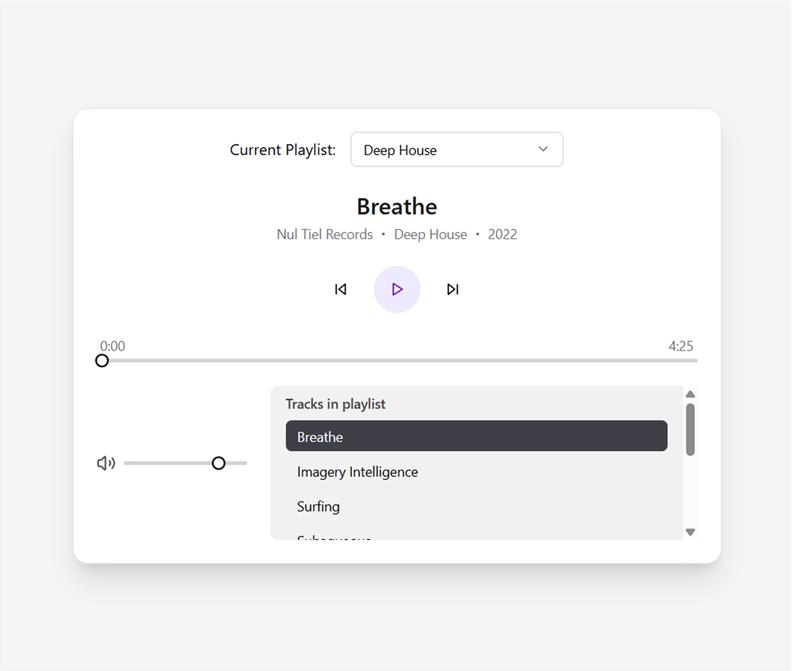
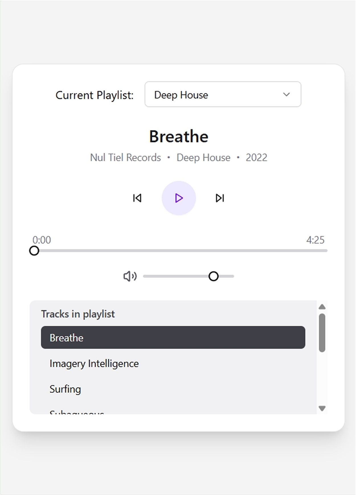

# 🎧 Linear Media Player

A fully functional, responsive audio player built with React, Tailwind CSS, and ShadCN UI. This project demonstrates real-world media control, dynamic playlist rendering, and UI polish — designed for both desktop and mobile.

## 🌐 Live Demo

[https://linear-media-player-pearl.vercel.app/](https://linear-media-player-pearl.vercel.app/)

## 📸 Screenshots

### 🖥️ Desktop View

### 📱 Mobile View

## 🚀 Highlights

- 🎵 Dynamic playlist loading from structured JSON
- ⏯️ Play/pause, skip tracks, and manual seek
- 📈 Real-time progress bar synced with audio
- 🔊 Volume control with slider
- 🔄 Auto-play on track and playlist changes
- 🎹 Keyboard controls (`Space` to play/pause)
- 📱 Fully responsive layout
- 💅 Styled with Tailwind CSS and animated with Motion
- 🧩 Component-based architecture using ShadCN UI

## 🛠 Tech Stack

| Area           | Tools                                      |
| -------------- | ------------------------------------------ |
| **Frontend**   | React, TypeScript, Tailwind CSS, ShadCN UI |
| **Animations** | Motion                                     |
| **Deployment** | Vercel                                     |
| **Audio APIs** | Native HTMLAudioElement, React Refs        |
